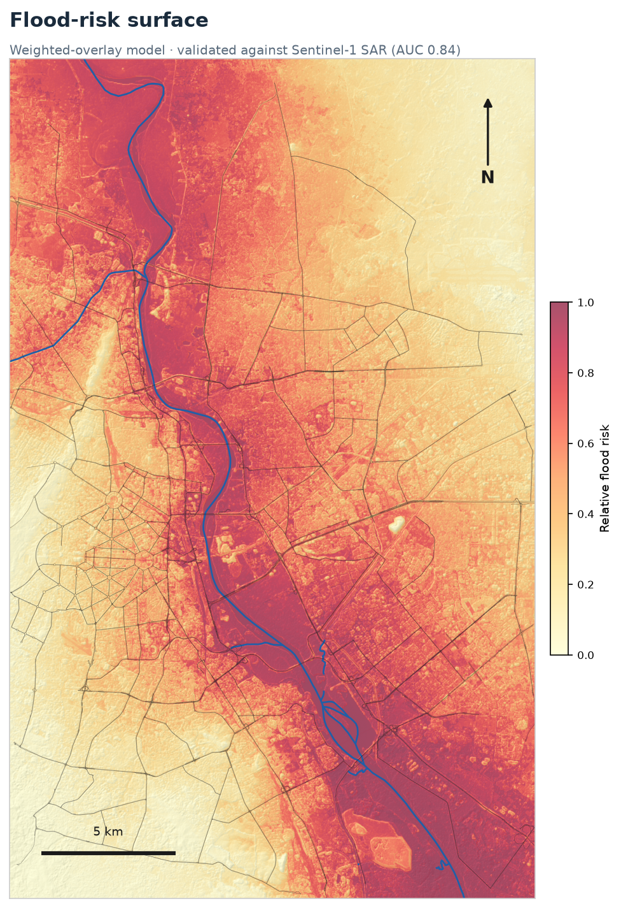
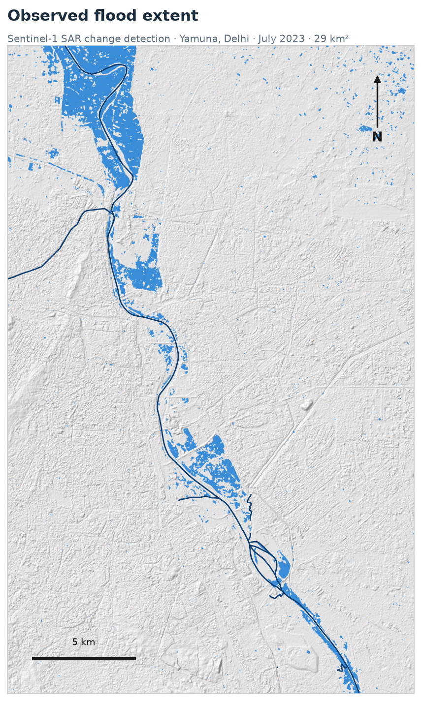

# Yamuna Urban Flood Mapper — Delhi

Detecting the **July 2023 Yamuna flood** from satellite radar, then building and **machine-learning-validating** an urban flood-risk model for the Delhi floodplain — and translating it into *people at risk*. Entirely in Python / Jupyter, with open data and no desktop GIS.

> 📊 **Interactive dashboard:** open [`index.html`](index.html) locally, or enable GitHub Pages to publish it.



---

## What this project does

In July 2023 the Yamuna crossed a record **208.66 m** and inundated large parts of the Delhi floodplain. This project turns open satellite data into:

1. **Observed flood extent** (Phase 1) — where it actually flooded, from Sentinel-1 radar change detection.
2. **A flood-risk model** — where flooding is *likely in general*, built two ways and validated against the real flood:
   - **Phase 1:** a transparent **weighted overlay** of terrain factors (AUC 0.84).
   - **Phase 2:** an **XGBoost** model with spatial cross-validation (AUC 0.92), explained with SHAP and translated into **people at risk** per district.

Everything is documented step by step for someone new to GIS.

---

## Key results

| Result | Value |
|---|---|
| Observed flood extent (Jul 2023, SAR) | **~29 km²** within the Delhi corridor |
| Phase 1 risk model (weighted overlay) | AUC **0.84** |
| Phase 2 risk model (XGBoost, **spatial** CV) | AUC **0.92** |
| People in high-susceptibility zones | **~613,000** |
| Area mapped | ~610 km² Yamuna corridor, 10 m resolution |

**Most exposed districts** (residents in high-susceptibility zones):

| District | Population | At risk | % |
|---|--:|--:|--:|
| East Delhi | 1,198,228 | 183,609 | 15.3 |
| Central Delhi | 1,305,585 | 173,388 | 13.3 |
| North East Delhi | 1,379,113 | 79,962 | 5.8 |
| North Delhi | 307,867 | 58,733 | 19.1 |

### Observed flood extent (July 2023)



---

## How it works

```
Sentinel-1 SAR (pre + post) ─► change detection ─► flood mask ──────────────┐ (labels)
                                                                            │
Elevation · slope · distance-to-river · built-up ──► weighted overlay ──► risk map  (Phase 1)
        + HAND · curvature · local relief ─────────► XGBoost (spatial CV) ─► ML susceptibility  (Phase 2)
                                                                            └─► × WorldPop ─► people at risk
```

**Phase 1 — `notebooks/`**
1. `01_get_sar_data` — pull pre/post Sentinel-1 VV composites from Google Earth Engine.
2. `02_flood_mask` — speckle filter, change-detect, threshold → binary flood mask.
3. `03_context_layers` — DEM, slope, distance-to-river, built-up, aligned to the flood grid.
4. `04_risk_map` — weighted-overlay risk, validation, road ranking, maps.

**Phase 2 — `phase2/`**
5. `05_feature_table` — engineer HAND/curvature/relief, build a balanced training table.
6. `06_train_xgboost` — train XGBoost; **random vs. spatial cross-validation**; SHAP.
7. `07_predict_susceptibility` — apply the model city-wide; compare to Phase 1.
8. `08_economic_risk` — overlay WorldPop population → people at risk by district.

`build_dashboard.py` assembles everything into `index.html`.

---

## Why the validation is honest

Geospatial data is spatially auto-correlated, so ordinary random cross-validation **leaks** neighbouring pixels and inflates the score. We report both:

```
Random  CV AUC: 0.97   ← optimistic (leakage)
Spatial CV AUC: 0.92   ← honest (block cross-validation)  ← reported
```

The SHAP analysis shows **distance-to-river** and **HAND** as the dominant drivers, with **built-up** pushing predictions toward "dry."

---

## ⚠️ Honest limitations

- **SAR detects *riverine* flooding, not street waterlogging.** It's largely blind to shallow water between buildings — the kind that strands motorists. The road ranking reflects floodplain exposure, not live street flooding.
- **`built-up` partly encodes a sensor blind-spot.** The model leans on it because SAR can't see flooding *inside* built-up areas — so "built-up → dry" is partly bias, not safety.
- **Single-event labels, relative risk.** Validated against one flood (July 2023); risk is relative within the AOI. "People at risk" is an *exposure* estimate, not a casualty forecast.

These define the scope honestly — and point straight at what a v3 would fix.

---

## Reproduce it

```bash
conda env create -f environment.yml
conda activate yamuna-flood
jupyter lab          # run notebooks/01–04, then phase2/05–08
python build_dashboard.py   # regenerate index.html
```

You'll need a free **Google Earth Engine** account; set `EE_PROJECT` in `01_get_sar_data.ipynb`.

---

## Repository structure

```
yamuna-flood-mapper/
├── notebooks/            # Phase 1 — SAR flood detection + weighted-overlay risk
│   ├── 01_get_sar_data.ipynb
│   ├── 02_flood_mask.ipynb
│   ├── 03_context_layers.ipynb
│   └── 04_risk_map.ipynb
├── phase2/               # Phase 2 — ML susceptibility + exposure
│   ├── 05_feature_table.ipynb
│   ├── 06_train_xgboost.ipynb
│   ├── 07_predict_susceptibility.ipynb
│   ├── 08_economic_risk.ipynb
│   └── flood_model.json  # trained XGBoost model
├── data/outputs/         # maps, risk surfaces, ranked roads, district scores
├── build_dashboard.py    # builds the dashboard
├── index.html            # the dashboard
├── environment.yml
└── README.md
```

*(Large intermediate rasters are regenerated by the notebooks and are git-ignored.)*

---

## Data sources

| Dataset | Source | Used for |
|---|---|---|
| Sentinel-1 GRD (SAR) | ESA, via Google Earth Engine | Flood detection |
| Copernicus GLO-30 DEM | ESA, via Earth Engine | Elevation, slope, HAND |
| ESA WorldCover 10 m | ESA, via Earth Engine | Built-up surface |
| WorldPop 100 m (2020) | WorldPop, via Earth Engine | Population exposure |
| River, road & district boundaries | OpenStreetMap (`osmnx`) | Distance-to-river, roads, districts |

---

## Roadmap (v3)

- Move from floodplain exposure to true **pluvial street-flooding** using assembled urban-waterlogging labels (traffic-police / PWD hotspots).
- Add **rainfall** (GPM IMERG) so risk becomes rainfall-conditioned, toward live motorist alerts.

---

*Built with Sentinel-1, Google Earth Engine, rasterio, geopandas, xgboost, shap, and matplotlib.*
